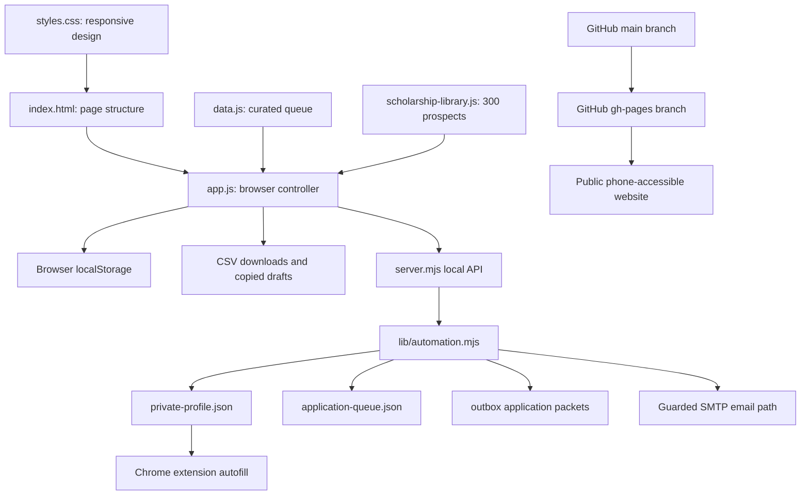

# Scholarship Robot: Detailed Build Guide

This document explains how the Scholarship Robot was designed, written, tested,
and published. It covers the exact project structure, the programming languages
used, the purpose of each file, the main code sections, and the commands used to
run and deploy the system.

The project has two connected parts:

1. A public scholarship dashboard that can be opened from a phone or computer.
2. A private local automation service that handles personal data, application
   packets, guarded email preparation, and browser autofill.

The public application is available at:

<https://kieronhaynes38-king.github.io/Kieron-s-portfolio/scholarship-robot/>

## 1. Technology Summary

No frontend framework, npm package, Python environment, cloud database, or paid
API is required. The application was intentionally built with browser and Node.js
features that are already available.

| Technology | File extensions | Purpose |
| --- | --- | --- |
| HTML5 | `.html` | Defines the dashboard, controls, tables, forms, and page structure. |
| CSS3 | `.css` | Controls desktop and mobile layout, colors, spacing, responsive behavior, and component states. |
| JavaScript | `.js` | Runs the browser interface, filtering, matching, drafting, exports, and local storage. |
| Node.js ES modules | `.mjs` | Runs the local web server, safety engine, packet generator, CLI, MIME email builder, and SMTP client. |
| JSON | `.json` | Stores structured applicant, scholarship, queue, and Chrome extension configuration data. |
| PowerShell | `.ps1` | Finds Node.js, starts or stops the local service, and passes CLI commands to the robot. |
| Windows Batch | `.cmd` | Provides double-click start and stop shortcuts. |
| VBScript | `.vbs` | Starts the PowerShell server without leaving a visible terminal window open. |
| CSV | `.csv` | Stores or exports scholarship queues in a spreadsheet-compatible format. |
| Markdown | `.md` | Documents the project, review packets, tests, and this build guide. |

The browser code uses standard JavaScript. The local service uses Node.js built-in
modules such as `node:http`, `node:fs`, `node:path`, `node:tls`, and
`node:assert`. That is why the application does not need an `npm install`.

## 2. Final Folder Structure

The primary project folder is:

```text
scholarship-robot/
|-- index.html
|-- styles.css
|-- data.js
|-- scholarship-library.js
|-- app.js
|-- server.mjs
|-- bot.mjs
|-- bot.ps1
|-- serve.ps1
|-- start-hidden.vbs
|-- start-scholarship-robot.cmd
|-- stop-scholarship-robot.ps1
|-- stop-scholarship-robot.cmd
|-- README.md
|-- BUILD_GUIDE.md
|-- manual-test-checklist.md
|-- top_50_apply_queue.csv
|-- .gitignore
|-- config/
|   `-- private-profile.example.json
|-- state/
|   `-- application-queue.example.json
|-- lib/
|   `-- automation.mjs
|-- tests/
|   `-- run-tests.mjs
`-- extension/
    |-- manifest.json
    |-- popup.html
    |-- popup.js
    `-- content.js
```

Files such as the real `private-profile.json`, real application queue, logs,
outbox packets, and SMTP credentials are intentionally excluded from Git.

## 3. System Architecture



The public site can search scholarships, generate draft material, save notes in
the browser, and export CSV files. It cannot access the private local profile,
private attachments, Gmail app password, local outbox, or local API.

## 4. Creating the Project in VS Code

The project was built as normal text files. In VS Code, the process is:

1. Open VS Code.
2. Choose **File > Open Folder**.
3. Open the repository folder.
4. Create a folder named `scholarship-robot`.
5. Create the subfolders `config`, `state`, `lib`, `tests`, and `extension`.
6. Create each file with the exact name and extension shown above.
7. Type or paste the matching language into each file.
8. Save the files with `Ctrl+S`.

The file extension tells VS Code how to highlight and validate the code:

- `.html` activates HTML editing.
- `.css` activates CSS editing.
- `.js` activates browser JavaScript editing.
- `.mjs` activates JavaScript ES module editing for Node.js.
- `.json` activates structured JSON validation.
- `.ps1` activates PowerShell editing.

The frontend files were placed in the root of `scholarship-robot` because every
relative URL in `index.html` points to that same folder:

```html
<link rel="stylesheet" href="./styles.css?v=20260611-2" />
<script src="./data.js?v=20260611-2"></script>
<script src="./scholarship-library.js?v=20260611-2"></script>
<script src="./app.js?v=20260611-2"></script>
```

The script order is important:

1. `data.js` creates `window.SCHOLARSHIP_ROBOT_DATA`.
2. `scholarship-library.js` creates `window.SCHOLARSHIP_LIBRARY`.
3. `app.js` reads both objects and renders the interface.

If `app.js` loaded first, its data variables would not exist yet.

The version query, `?v=20260611-2`, was added after deployment because GitHub
Pages and browsers can temporarily cache old JavaScript and CSS. Changing the
version forces the browser to request the current files.

## 5. Building the HTML Interface

### File

`scholarship-robot/index.html`

### Language

HTML5

### Purpose

This file defines everything that appears on the page. It contains labels,
buttons, search inputs, filters, empty containers, and one reusable detail
template. JavaScript fills those containers with live content.

The document begins with standard browser metadata:

```html
<!doctype html>
<html lang="en">
  <head>
    <meta charset="utf-8" />
    <meta name="viewport" content="width=device-width, initial-scale=1" />
    <title>Scholarship Robot</title>
    <link rel="stylesheet" href="./styles.css?v=20260611-2" />
  </head>
```

The viewport line is essential for phones. Without it, a mobile browser may
render the page as a scaled desktop page.

### Main HTML sections

The page is divided into the following major sections:

| Section | Main IDs | Responsibility |
| --- | --- | --- |
| Header | `exportTop50` | Displays the product name and primary export command. |
| Applicant verification | `profileGate`, `degreeVerified`, `transcriptVerified`, `identityConfirmed` | Prevents the UI from treating unverified profile facts as submission-ready. |
| Dashboard statistics | `stats` | Shows queue totals, verified records, blocked records, and monitoring counts. |
| Submission console | `profileTruth`, `missingFields`, `submissionAttempts` | Displays known facts and missing submission requirements. |
| Local automation panel | `automationServiceStatus`, `automationRows` | Connects the web interface to the private Node.js API when running locally. |
| Direct application finder | `radarSearch`, `radarFocus`, `radarRows` | Filters high-value direct application links. |
| 300-scholarship workspace | `librarySearch`, `libraryResults`, `libraryDetail` | Searches, ranks, displays, and drafts material for the large prospect library. |
| Curated CRM queue | `scholarshipRows`, `detail` | Tracks selected, verified, blocked, drafted, and submitted scholarship records. |
| Writing panel | `promptBox`, `toneSelect`, `draftBox` | Builds an editable scholarship response or application packet. |
| Acceptance checks | `checks` | Displays automated readiness and safety checks. |

Most containers start empty:

```html
<div id="libraryResults" class="library-results"></div>
<aside id="libraryDetail" class="library-detail-panel" aria-live="polite"></aside>
```

`app.js` later inserts scholarship buttons and detail content into these
containers.

The reusable detail panel is placed in an HTML template:

```html
<template id="detailTemplate">
  <p class="eyebrow">Selected Opportunity</p>
  <h2 data-field="name"></h2>
  <p class="detail-summary" data-field="summary"></p>
  ...
</template>
```

JavaScript clones the template, fills elements identified by `data-field`, and
adds it to the page. This avoids writing the same HTML manually for every
scholarship.

## 6. Styling the Desktop and Phone Layout

### File

`scholarship-robot/styles.css`

### Language

CSS3

### Purpose

The stylesheet controls visual design and responsive behavior. It defines color
variables, grids, buttons, badges, panels, tables, forms, library results, and
mobile breakpoints.

The first section uses CSS custom properties:

```css
:root {
  --ink: #182033;
  --muted: #647087;
  --line: #d9dfeb;
  --surface: #ffffff;
  --accent: #0d6a62;
}
```

Variables keep the design consistent. A component can use `var(--accent)`
instead of repeating a color value.

The main workspace uses CSS Grid. The scholarship library uses a result column
and a detail column on larger screens:

```css
.library-layout {
  display: grid;
  grid-template-columns: minmax(300px, 0.8fr) minmax(0, 1.4fr);
  gap: 16px;
}
```

`minmax(0, ...)` is important because it allows long text to shrink inside the
grid instead of forcing horizontal overflow.

Responsive sections are placed near the bottom:

```css
@media (max-width: 1120px) {
  /* Collapse wide dashboard and library layouts. */
}

@media (max-width: 680px) {
  /* Stack controls, reduce padding, and make the phone view readable. */
}
```

The final mobile verification used a 375-pixel viewport. The page reported:

```text
body width: 375
viewport width: 375
horizontal overflow: false
```

That check confirmed that the phone layout did not extend beyond the screen.

## 7. Creating the Curated Scholarship Data

### File

`scholarship-robot/data.js`

### Language

JavaScript object data

### Purpose

This file creates the smaller, carefully curated CRM queue and general applicant
story bank:

```js
window.SCHOLARSHIP_ROBOT_DATA = {
  applicant: { ... },
  submissionAttempts: [],
  statuses: [ ... ],
  opportunitySources: [ ... ],
  scholarships: [ ... ]
};
```

The public version uses generalized applicant labels. Exact contact information,
street address, date of birth, and transcript values remain in the private local
profile instead of the public JavaScript.

Each curated scholarship follows a common schema:

```js
{
  id: "asem-grad",
  name: "ASEM Undergraduate and Graduate Student Scholarships",
  sponsor: "American Society for Engineering Management",
  category: "Engineering Management",
  url: "https://asem.org/ASEM-Scholarships",
  applicationMethod: "email",
  contactEmail: "scholarship@asem.org",
  amount: "$500",
  deadline: "2026-07-15",
  status: "verified",
  verifiedOn: "2026-06-03",
  eligibility: "...",
  materials: "...",
  aiPolicy: "unknown",
  sensitiveTags: [],
  matchScore: 98,
  matchReasons: ["...", "..."],
  risks: ["...", "..."],
  nextAction: "..."
}
```

The important fields are:

- `id`: Stable internal identifier.
- `url`: Direct sponsor or application page.
- `applicationMethod`: `online`, `email`, `portal`, `internal`, or `search`.
- `deadline`: Date or a verification label when the current cycle is unclear.
- `aiPolicy`: `unknown`, `restricted`, `prohibited`, or another reviewed value.
- `sensitiveTags`: Eligibility facts the applicant must personally confirm.
- `matchScore`: Initial fit score from 0 to 100.
- `matchReasons`: Human-readable explanation for the score.
- `risks`: Missing facts or reasons not to submit yet.
- `nextAction`: The immediate next step.

The status list defines the CRM workflow:

```js
[
  "prospect",
  "verified",
  "drafted",
  "ready_for_review",
  "filled_pause",
  "submitted_by_user",
  "not_eligible",
  "closed",
  "monitor_next_cycle"
]
```

## 8. Creating the 300-Scholarship Library

### File

`scholarship-robot/scholarship-library.js`

### Language

Generated JavaScript object data

### Purpose

This is the large prospect library. It contains 300 unique scholarship profile
URLs. The file is large because every record includes ranking, category,
personalized fit reasons, safety risks, and drafting themes.

The top-level shape is:

```js
window.SCHOLARSHIP_LIBRARY = {
  generatedAt: "2026-06-11T18:48:25.282Z",
  source: "Scholarships360 official scholarship profile sitemap and profile pages",
  sourceUrl: "https://scholarships360.org/sitemap_index.xml",
  verificationDate: "2026-06-11",
  disclaimer: "Prospect library only...",
  scholarships: [ ...300 records... ]
};
```

Each record uses this structure:

```js
{
  id: "library-example-scholarship",
  title: "Example Scholarship",
  sponsor: "Provider listed on the live scholarship page",
  url: "https://...",
  description: "Open the live page to verify...",
  amount: "Check live page",
  deadline: "Recheck live page",
  gradeLevel: "Graduate students indicated by listing title",
  citizenship: "Recheck live page",
  prompt: "Review the live application prompt before using a draft.",
  modified: "2025-11-17T20:15:40+00:00",
  category: "Graduate & General",
  storyTheme: "graduate",
  fitScore: 98,
  fitReasons: ["...", "..."],
  risks: ["...", "..."],
  sensitiveTags: [],
  aiPolicy: "unknown",
  status: "prospect",
  applicationMethod: "online",
  verifiedOn: "2026-06-11"
}
```

This library is intentionally described as a prospect library, not a list of
automatically approved applications. Every live page must still be checked for
the actual deadline, eligibility, AI policy, and legal certifications.

The final data check confirmed:

```text
records: 300
unique IDs: 300
unique URLs: 300
```

## 9. Writing the Browser Application Controller

### File

`scholarship-robot/app.js`

### Language

Vanilla browser JavaScript

### Purpose

This is the main controller for the public interface. It reads the two global
data objects, connects HTML elements, calculates scores, renders content, saves
notes, builds draft responses, exports CSV files, and connects to the local API.

### 9.1 Private scope

The entire file is wrapped in an Immediately Invoked Function Expression:

```js
(function () {
  // Application code
})();
```

This keeps variables such as `state`, `els`, and `selectedId` out of the global
browser namespace.

### 9.2 Loading data and storing browser state

At the beginning:

```js
const data = window.SCHOLARSHIP_ROBOT_DATA;
const libraryData = window.SCHOLARSHIP_LIBRARY || { scholarships: [] };
const storageKey = "scholarshipRobotState.v1";
const libraryStorageKey = "scholarshipRobotLibrary.v1";
```

The application has two local browser records:

- `scholarshipRobotState.v1` stores verification checkboxes, queue status
  overrides, and curated scholarship notes.
- `scholarshipRobotLibrary.v1` stores the 300-library shortlist, review status,
  and notes.

The code reads and writes these records with `localStorage`:

```js
function saveLibraryState() {
  localStorage.setItem(libraryStorageKey, JSON.stringify(libraryState));
}
```

This allows notes to survive a page refresh without creating an online account.
The information stays in that browser profile.

### 9.3 Connecting JavaScript to HTML

The `els` object stores references to HTML controls:

```js
const els = {
  profileGate: document.getElementById("profileGate"),
  librarySearch: document.getElementById("librarySearch"),
  libraryResults: document.getElementById("libraryResults"),
  libraryDetail: document.getElementById("libraryDetail")
};
```

The names must match the `id` attributes in `index.html`.

### 9.4 Safety checks

The `safety(item)` function creates warnings and hard blocks. It checks:

- Whether education and transcript information were verified.
- Whether the deadline passed.
- Whether AI rules are unknown, restricted, or prohibited.
- Whether sensitive eligibility facts need confirmation.
- Whether the scholarship uses email.
- Whether the current profile is marked ineligible.

Simplified logic:

```js
if (item.aiPolicy === "unknown") {
  warnings.push({
    level: "danger",
    text: "AI policy is unknown. Do not submit generated writing until policy is checked."
  });
}
```

`canMoveToReview(item)` refuses to mark an application review-ready when a
danger warning exists.

### 9.5 Ranking logic

The curated score begins with `matchScore` and applies adjustments:

```js
function adjustedScore(item) {
  let score = item.matchScore;
  if (effectiveStatus(item) === "verified") score += 6;
  if (item.applicationMethod === "search") score -= 15;
  if (isExpired(item)) score -= 18;
  if (item.status === "not_eligible") score -= 40;
  if (item.aiPolicy === "prohibited") score -= 8;
  if (item.sensitiveTags.length && !state.identityConfirmed) score -= 4;
  return Math.max(0, Math.min(100, score));
}
```

The result is clamped between 0 and 100.

### 9.6 Filtering

`filteredItems()` combines:

- Text search.
- Category filter.
- Status filter.
- Blocked-record visibility.

`filteredLibraryItems()` separately handles:

- Library search.
- Category.
- Sensitive eligibility visibility.
- Sort by fit, name, or recent modification date.

### 9.7 Pagination

The 300-record library displays 12 records at a time:

```js
const pageSize = 12;
const pageCount = Math.max(1, Math.ceil(items.length / pageSize));
const visible = items.slice(
  libraryPageIndex * pageSize,
  (libraryPageIndex + 1) * pageSize
);
```

This keeps the page responsive instead of inserting 300 large result blocks at
once.

### 9.8 Personalized draft generation

`buildLibraryDrafts(item)` creates several response lengths based on the
scholarship's `storyTheme`. The supporting function `libraryThemeCopy(theme)`
selects verified story material for technical, leadership, service, creative,
entrepreneurship, resilience, or general graduate prompts.

The public drafts are starting points. The UI warns the applicant to review the
live prompt and rewrite final text when the sponsor restricts AI.

The smaller curated queue uses `buildDraft(item)` to combine:

- The scholarship name.
- The pasted prompt.
- The selected tone.
- Match reasons.
- Portfolio or film evidence.
- An AI-policy warning.

### 9.9 CSV export

`exportCsv(kind)` creates:

- Top 50 queue.
- Full prospect list.
- Status tracker.
- Direct application links.

The rows are converted to CSV-safe values:

```js
function csvCell(value) {
  return `"${String(value ?? "").replace(/"/g, '""')}"`;
}
```

The browser creates a temporary `Blob`, generates a download URL, clicks a
temporary anchor, and revokes the URL afterward.

### 9.10 Escaping dynamic HTML

The UI inserts data with template strings, so dynamic text is passed through:

```js
function escapeHtml(value) {
  return String(value ?? "")
    .replace(/&/g, "&amp;")
    .replace(/</g, "&lt;")
    .replace(/>/g, "&gt;")
    .replace(/"/g, "&quot;")
    .replace(/'/g, "&#039;");
}
```

This prevents scholarship titles or notes from being interpreted as executable
HTML.

### 9.11 Event binding and startup

`bindEvents()` connects clicks, typing, checkbox changes, filter changes,
pagination, copy buttons, and export buttons to functions.

The bottom of the file starts the application in this order:

```js
renderFilters();
renderLibraryFilters();
bindEvents();
render();
runChecks();
loadAutomation();
```

## 10. Building the Local Node.js Server

### File

`scholarship-robot/server.mjs`

### Language

Node.js JavaScript using ES modules

### Purpose

The server performs two jobs:

1. Serves the local HTML, CSS, and JavaScript.
2. Provides private `/api/` routes for profile validation, queue status,
   application packet preparation, approval, and guarded email sending.

The server uses Node's built-in HTTP module:

```js
import http from "node:http";

export async function startServer({ host = "127.0.0.1", port = 4173 } = {}) {
  const server = http.createServer(async (request, response) => {
    // Route API requests or serve approved static files.
  });
}
```

Binding to `127.0.0.1` means the private service is only available on the local
computer. The public GitHub Pages site does not expose this server.

### API routes

| Route | Method | Purpose |
| --- | --- | --- |
| `/api/health` | GET | Returns service health, profile validation, queue counts, and SMTP availability. |
| `/api/profile` | GET | Returns a redacted profile, not the full private identity. |
| `/api/queue` | GET | Returns the application queue and summary. |
| `/api/prepare-all` | POST | Builds review packets for every queued application. |
| `/api/applications/:id/prepare` | POST | Builds one packet. |
| `/api/applications/:id/approve` | POST | Records per-application email approval. |
| `/api/applications/:id/send` | POST | Sends an approved email-only application after all guards pass. |
| `/api/applications/:id/status` | POST | Updates the tracked status. |

POST requests require a local request marker:

```js
const localHeader = request.headers["x-scholarship-robot"];
if ((origin && origin !== expectedOrigin) || localHeader !== "local-ui") {
  // Return HTTP 403.
}
```

Static file serving uses an allowlist:

```js
const publicFiles = new Set([
  "index.html",
  "app.js",
  "data.js",
  "scholarship-library.js",
  "styles.css"
]);
```

This was updated when `scholarship-library.js` was added. Without the update,
the local server returned `404 Not Found` for the new library.

## 11. Building the Automation and Safety Engine

### File

`scholarship-robot/lib/automation.mjs`

### Language

Node.js JavaScript using ES modules

### Purpose

This file contains the private application logic. It validates profile data,
evaluates scholarships, generates application packets, builds `.eml` messages,
handles attachments, summarizes the queue, and performs guarded SMTP sending.

### 11.1 File paths

The module calculates paths relative to itself:

```js
const moduleDir = path.dirname(fileURLToPath(import.meta.url));
export const APP_ROOT = path.resolve(moduleDir, "..");
export const PROFILE_PATH = path.join(APP_ROOT, "config", "private-profile.json");
export const QUEUE_PATH = path.join(APP_ROOT, "state", "application-queue.json");
export const OUTBOX_PATH = path.join(APP_ROOT, "outbox");
```

This lets the robot work regardless of the absolute folder location.

### 11.2 Atomic JSON writing

Queue files are written to a temporary file and renamed:

```js
export async function writeJsonAtomic(filePath, value) {
  const temporary = `${filePath}.tmp`;
  await fs.writeFile(temporary, `${JSON.stringify(value, null, 2)}\n`, "utf8");
  await fs.rename(temporary, filePath);
}
```

This reduces the risk of leaving a half-written JSON file if the process stops
during a save.

### 11.3 Profile validation

`validateProfile(profile)` checks required fields and format rules:

- Full name.
- First and last name.
- Scholarship email.
- Phone number.
- Street, city, state, and ZIP code.
- Current school, degree, major, and expected graduation.
- Graduate GPA.

It also checks email structure, phone length, ZIP format, and GPA range.

### 11.4 Application evaluation

`evaluateApplication(application, profile)` is the core guardrail function.

It blocks:

- Missing or invalid profile values.
- Passed deadlines.
- Postal-only applications.
- Excluded records.
- Required login accounts.
- Required recommendation letters.
- Applicant signatures or certifications.
- Prohibited or restricted AI writing.
- Unknown AI policy that has not been reviewed.
- Unconfirmed sensitive eligibility.
- Unverified email recipients.
- Email records without per-application approval.
- Missing attachment paths.

For online forms, it returns:

```js
action: "browser_fill_pause"
```

For email-only applications, it returns:

```js
action: "email"
```

### 11.5 Browser packets

`buildBrowserPacket()` converts the private profile into a structured packet
containing common application fields. It also includes a `stopBefore` list:

```js
stopBefore: [
  "final submit",
  "electronic signature",
  "applicant-only certification",
  "recommendation attestation",
  "payment or fee",
  "SSN, FSA ID, tax, banking, or identity-document request"
]
```

This is the technical implementation of fill-and-pause mode.

### 11.6 Review packet output

`prepareApplication()` creates a private folder:

```text
outbox/<application-id>/
|-- application-packet.json
|-- review.md
`-- application.eml
```

The `.eml` file is created only for email applications.

### 11.7 Email generation and SMTP

`buildEmailContent()` fills templates such as:

```text
{{scholarship}}
{{fullName}}
{{currentDegree}}
{{graduateGpa}}
{{portfolio}}
```

`buildEml()` creates a standards-compatible multipart MIME email. Attachments
are read as bytes, converted to Base64, wrapped, and placed between MIME
boundaries.

`sendApprovedEmailApplication()` refuses to send unless:

- The application method is email.
- Every evaluation block is cleared.
- The command includes the exact confirmation value `SEND`.
- SMTP credentials exist in environment variables.

The credentials are read from:

```text
SCHOLARSHIP_SMTP_USER
SCHOLARSHIP_SMTP_APP_PASSWORD
```

They are never typed into source code.

## 12. Creating the Command-Line Robot

### File

`scholarship-robot/bot.mjs`

### Language

Node.js JavaScript

### Purpose

This is a command-line entry point. It loads the private profile and queue, then
runs one of these commands:

```powershell
.\bot.ps1 check
.\bot.ps1 status
.\bot.ps1 prepare
.\bot.ps1 prepare application-id
.\bot.ps1 serve --port 4173
```

The command is read from:

```js
const [command = "status", argument] = process.argv.slice(2);
```

The `send` command additionally requires:

```text
--confirm SEND
```

After a successful email send, the queue record receives `submittedAt` and a
receipt containing the recipient, subject, and SMTP response.

## 13. Creating the Windows Launch Files

### `serve.ps1`

This PowerShell script:

1. Accepts a port.
2. Checks whether that port is already listening.
3. Locates the Node.js runtime bundled with Codex.
4. Falls back to a normal `node` command if needed.
5. starts `server.mjs`.

### `bot.ps1`

This script finds Node.js and passes all remaining arguments to `bot.mjs`.

### `start-hidden.vbs`

This VBScript starts PowerShell with window style `0`, which hides the terminal:

```vbscript
shell.Run command, 0, False
```

### `start-scholarship-robot.cmd`

This double-click launcher:

1. Changes into the project folder.
2. starts `start-hidden.vbs`.
3. Waits two seconds.
4. Opens `http://127.0.0.1:4173/`.

### Stop scripts

`stop-scholarship-robot.ps1` finds the process listening on port 4173 and stops
that exact process. `stop-scholarship-robot.cmd` provides the double-click
wrapper.

## 14. Building the Private Profile and Queue

### Profile template

`scholarship-robot/config/private-profile.example.json`

The template contains:

```json
{
  "identity": {
    "fullName": "Applicant name",
    "email": "your-email@example.com",
    "phone": "000-000-0000",
    "address": {}
  },
  "education": {},
  "confirmations": {},
  "publicLinks": {}
}
```

To use it locally:

1. Duplicate the file.
2. Rename the copy to `private-profile.json`.
3. Enter verified applicant information.
4. Do not commit the new file.

### Queue template

`scholarship-robot/state/application-queue.example.json`

Each queue record contains the application method, recipient, deadline, AI
policy, requirements, approval status, and current status.

When the real queue is saved, it is written to:

```text
state/application-queue.json
```

## 15. Git Privacy Rules

### File

`scholarship-robot/.gitignore`

The following entries prevent private runtime files from being committed:

```gitignore
.env
config/private-profile.json
logs/
outbox/
state/application-queue.json
state/runtime.json
test-output/
```

Before the public deployment, the static files were scanned for exact contact
information, exact GPA values, medical details, and private identifiers. Public
applicant text was replaced with generalized language such as "strong graduate
academic record" and "stored in private local profile."

## 16. Building the Browser Autofill Extension

### Folder

`scholarship-robot/extension`

### Languages

Manifest JSON, HTML, and browser JavaScript

### `manifest.json`

This is a Chrome Manifest V3 extension. It requests only:

```json
["activeTab", "storage"]
```

The content script runs on HTTP and HTTPS pages after the document loads.

### `popup.html`

The popup provides:

- Import private profile.
- Fill current page.
- Clear stored profile.
- Status message.
- Warning about protected fields.

### `popup.js`

This file:

1. Parses the selected JSON profile.
2. Validates required values.
3. Stores the profile in `chrome.storage.local`.
4. Finds the active browser tab.
5. Sends a `SCHOLARSHIP_ROBOT_FILL` message to `content.js`.

### `content.js`

This script scans:

```js
document.querySelectorAll("input, select, textarea")
```

It builds a normalized description from the control's label, ARIA label,
placeholder, name, and ID.

It never fills controls matching:

```js
const PROTECTED_PATTERN =
  /\b(password|passcode|social security|ssn|bank|routing|account number|tax|fafsa|fsa id|signature|certif|recommendation|date of birth|dob|driver.?s license|passport)\b/i;
```

It also refuses:

- Hidden controls.
- Password fields.
- File uploads.
- Checkboxes.
- Radio buttons.
- Submit buttons.
- Disabled or read-only fields.

The extension dispatches real `input` and `change` events after inserting a
value. This helps JavaScript-based scholarship forms recognize the update.

The extension never clicks final submit.

## 17. Testing

### File

`scholarship-robot/tests/run-tests.mjs`

### Language

Node.js JavaScript using `node:assert/strict`

The tests verify:

- Profile validation.
- Queue summary counts.
- Browser fill-and-pause evaluation.
- Packet creation.
- Correct private field mapping.
- Applicant signature blocking.
- Unknown AI-policy blocking.
- MIME email content.
- Missing SMTP credential blocking.
- Exact `SEND` confirmation blocking.

The test creates a temporary directory under the Windows temporary folder. In a
`finally` block, it confirms that the directory is inside the system temporary
folder before deleting it.

JavaScript syntax was also checked with:

```powershell
node --check app.js
node --check data.js
node --check scholarship-library.js
node --check server.mjs
```

The 300-library structure was tested by loading it into a temporary
`window` object and counting records, IDs, and URLs.

The frontend was tested in a real browser at desktop width and phone width. The
live page was checked for:

- Correct title.
- Correct heading.
- `288 shown of 300` with sensitive records hidden by default.
- 12 result buttons per page.
- No console errors.
- No phone-width horizontal overflow.

## 18. Running the Robot Locally

### Double-click method

Double-click:

```text
start-scholarship-robot.cmd
```

Then open:

```text
http://127.0.0.1:4173/
```

### PowerShell method

From the `scholarship-robot` folder:

```powershell
.\serve.ps1 -Port 4173
```

### Direct Node.js method

```powershell
node .\server.mjs --port 4173
```

### Stop

Double-click:

```text
stop-scholarship-robot.cmd
```

## 19. Publishing to GitHub

The public source repository is:

<https://github.com/kieronhaynes38-king/Kieron-s-portfolio>

The Scholarship Robot was placed inside:

```text
Kieron-s-portfolio/
`-- scholarship-robot/
```

The initial source update was committed to the `main` branch. However, this
repository's GitHub Pages site publishes from a separate `gh-pages` branch.

The deployment therefore required two branch updates:

1. Commit the maintained source to `main`.
2. Copy the static frontend files to the `gh-pages` worktree.
3. Commit those files on the Pages branch.
4. Push the Pages commit to `origin/gh-pages`.

The five public runtime files copied to `gh-pages` were:

```text
scholarship-robot/index.html
scholarship-robot/styles.css
scholarship-robot/data.js
scholarship-robot/scholarship-library.js
scholarship-robot/app.js
```

The local private automation files are not needed by GitHub Pages because
GitHub Pages only serves static content.

The verified deployment commits were:

```text
main: eb2a240 Version public Scholarship Robot assets
gh-pages: 236e3d2 Refresh Scholarship Robot assets
```

GitHub reported the Pages deployment as `success`. The final page was then
opened with a deployment query to bypass browser cache:

```text
https://kieronhaynes38-king.github.io/Kieron-s-portfolio/scholarship-robot/?v=236e3d2
```

The permanent URL works without the query:

```text
https://kieronhaynes38-king.github.io/Kieron-s-portfolio/scholarship-robot/
```

## 20. What Runs Publicly and What Stays Private

### Public GitHub Pages features

- 300-scholarship searchable library.
- Curated opportunity queue.
- Match reasons and risk notes.
- Personalized draft starters.
- Filters and pagination.
- Shortlist and note storage in the current browser.
- CSV exports.
- Responsive computer and phone layouts.

### Private local-only features

- Exact applicant address and phone.
- Exact verified transcript and GPA values.
- Private application queue.
- Attachments.
- Outbox review packets.
- Browser autofill profile.
- SMTP credentials.
- Email sending.
- Local API actions.

The split is intentional. GitHub Pages is useful for reviewing and organizing
opportunities from any device, while sensitive automation remains on the
computer.

## 21. Safe Modification Workflow

When changing the application:

1. Edit the source in the `main` branch copy.
2. Run JavaScript syntax checks.
3. Test the local page.
4. Test at a phone viewport.
5. Scan public files for private data.
6. Commit and push `main`.
7. Copy only the five static runtime files into the `gh-pages` worktree.
8. Commit and push `gh-pages`.
9. Wait for GitHub Pages deployment success.
10. Open the public URL and verify the actual live content.

When adding a new scholarship, use the existing schema. Do not omit:

- Application URL.
- Verification date.
- Eligibility.
- Required materials.
- AI policy.
- Sensitive tags.
- Match reasons.
- Risks.
- Next action.

When changing public assets, update the version value in `index.html` if a phone
or browser continues loading cached files.

## 22. Important Design Decisions

### No framework

Vanilla HTML, CSS, and JavaScript keep the public site easy to host on GitHub
Pages and remove dependency installation failures.

### No public database

Browser notes use `localStorage`. This keeps the public site simple, but notes do
not automatically synchronize between a phone and computer.

### Data as JavaScript globals

The static site loads large datasets with normal `<script>` tags. This avoids
cross-origin and local-file JSON loading problems.

### Fill and pause

Online applications stop before signatures, certifications, legal terms, and
final submission. The applicant remains responsible for reviewing and
certifying the application.

### Explicit email approval

Email applications require verified eligibility, reviewed AI policy, valid
attachments, per-application approval, SMTP credentials, and the exact `SEND`
confirmation.

### Privacy-safe public build

The public dashboard contains generalized profile language. The local profile
contains the exact facts required for applications.

## 23. Troubleshooting

### The local page does not open

Check whether port 4173 is in use. Run:

```powershell
.\stop-scholarship-robot.ps1
.\serve.ps1 -Port 4173
```

### The library shows zero records

Confirm that `index.html` loads `scholarship-library.js` before `app.js`.
If using the local Node server, confirm `scholarship-library.js` is in the static
file allowlist.

### The public page looks old

GitHub Pages or the browser may be caching assets. Increase the version suffix:

```html
<script src="./app.js?v=new-version"></script>
```

Then deploy the changed `index.html` to `gh-pages`.

### The automation panel says the service is offline

That is expected on GitHub Pages. The private `/api/` service exists only at the
local `127.0.0.1` address.

### Notes are missing on another device

Notes are stored in browser `localStorage`. A phone and computer have separate
storage. Export CSV files when information needs to move between devices.

### Email will not send

Check:

- The record method is `email`.
- The recipient is verified.
- AI policy is reviewed.
- The deadline is open.
- Required attachments exist.
- No applicant signature or recommendation is missing.
- `approvedForSend` is true.
- Gmail app-password environment variables are set.
- The command includes `--confirm SEND`.

## 24. Final Result

The completed Scholarship Robot is a no-dependency scholarship CRM and
application-preparation system. It combines a public responsive web interface,
a private Node.js automation service, a guarded email engine, a browser autofill
extension, structured scholarship data, CSV exports, and safety checks.

The key principle throughout the code is separation:

- Public information is accessible anywhere.
- Private personal data remains local.
- Drafting is separated from legal submission.
- Unknown or prohibited AI use blocks automation.
- Email sending requires explicit approval.
- Every scholarship remains subject to live eligibility and deadline review.
